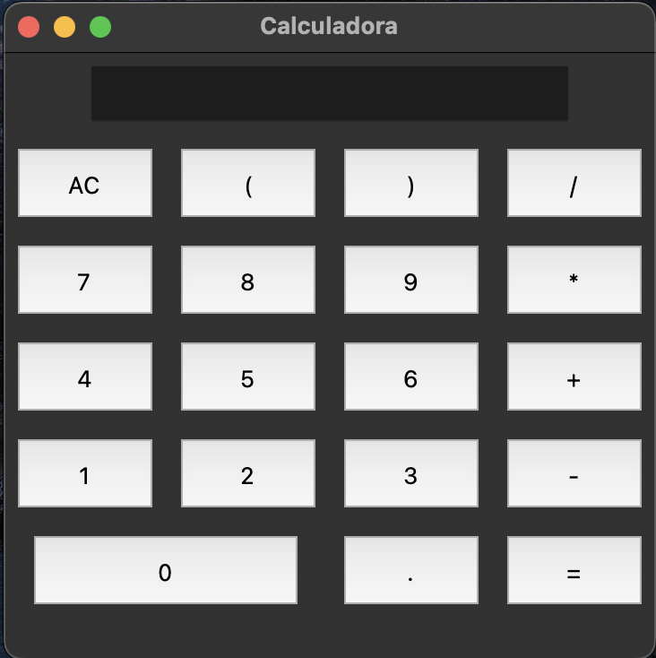

# Proyectos de Python

¡Bienvenido a mi repositorio de proyectos de Python! Aquí se encuentran varios proyectos de Python que he creado, que incluyen:

## Calculadora con interfaz gráfica
Esta es una calculadora que he creado usando la biblioteca de interfaz gráfica de usuario (GUI) tkinter de Python. La calculadora incluye las funciones básicas de suma, resta, multiplicación y división, y tiene una interfaz gráfica fácil de usar.

## Calculadora sin interfaz gráfica
Esta es una calculadora básica creada en Python sin una interfaz gráfica. La calculadora puede realizar operaciones básicas de suma, resta, multiplicación y división.

## Aplicación de descarga de YouTube
Esta es una aplicación que permite copiar enlaces de YouTube y descargarlos en formato de video o audio. La aplicación utiliza la biblioteca pytube de Python para descargar videos y audios de YouTube.

## Contador de palabras
Esta es una aplicación simple de Python que cuenta el número de palabras en un archivo de texto. El archivo de texto se puede ingresar como un argumento en la línea de comandos.

## Aplicación de números pares e impares
Esta es una aplicación básica que le pide al usuario que ingrese un número y luego determina si ese número es par o impar.

## Carrito de compras (Programación Orientada a Objetos)
El proyecto del carrito de compras utiliza los principios de la POO para crear una aplicación más estructurada y modular. En lugar de utilizar únicamente funciones y listas, este proyecto utiliza clases y objetos para representar el carrito de compras y los productos.

El carrito de compras implementa las siguientes funcionalidades:

Agregar productos al carrito.
Eliminar productos del carrito.
Calcular el total de la compra.
Mostrar el contenido del carrito y la información de cada producto.

¡Gracias por revisar mis proyectos de Python! Si tienes alguna pregunta o comentario, por favor no dudes en contactarme.
